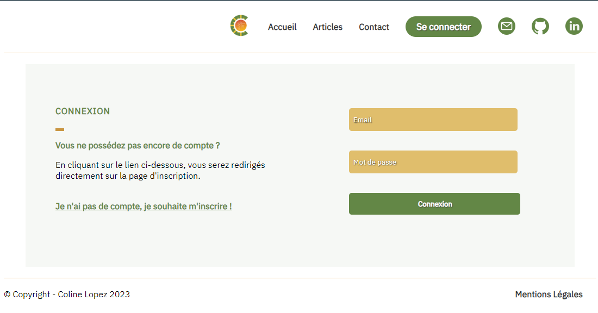
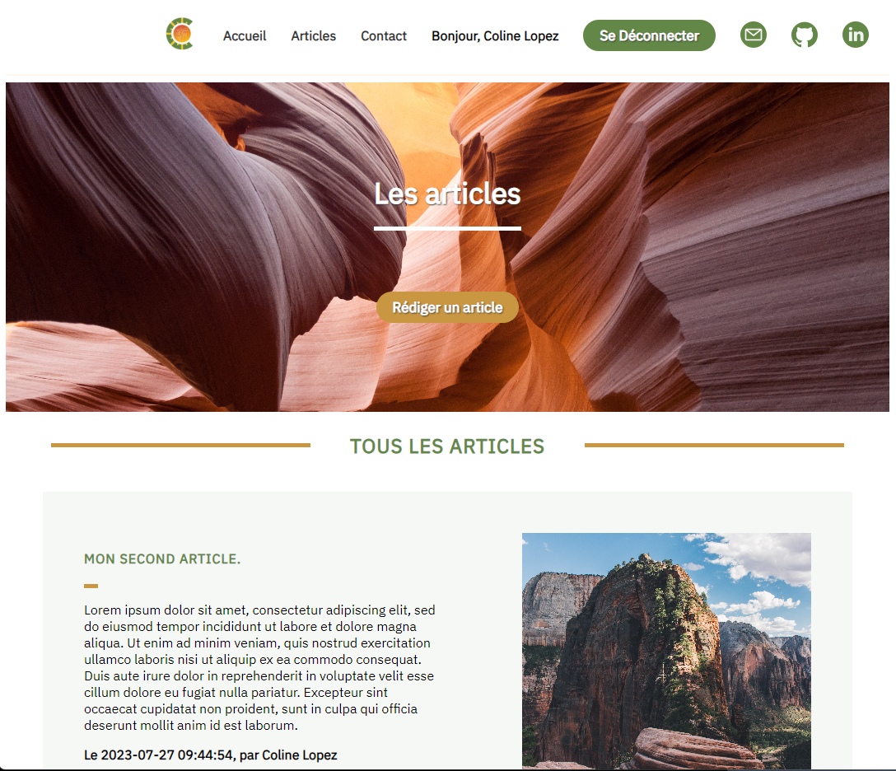
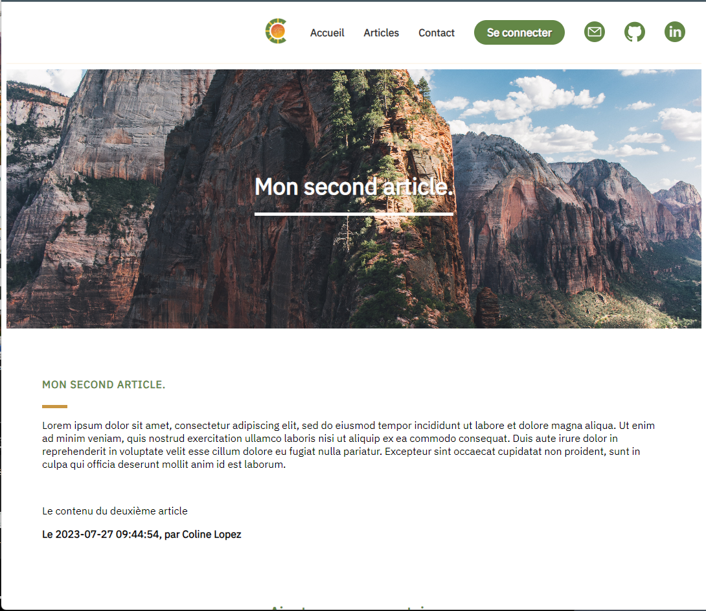

# 🌐 My Website - OpenClassrooms' Project 5

### 🌟 Project Overview

The main objective of this project is to create a professional blog using PHP. The website features two distinct categories of pages: those accessible to all visitors and those restricted to administrators.

🚀 Getting Started

1. Clone the repository
   
  `git clone https://github.com/ColineLopez/OpenClassrooms_Project_5_MyWebsite.git`

  `cd OpenClassrooms_Project_5_MyWebsite`

2. Set up your environment variables configuring it according to your environment.

   Ensure WAMP is running and properly configured.
  Create a new database in MySQL for the project.
  Import the database schema and data if available.

3. Configure the Project

  Update the database connection settings in the configuration file (e.g., config.php) to match your local environment.

4. Start the Local Server

  Make sure WAMP is running and access the project via localhost in your web browser.

## 🧩 Features

### 📝 Blog Management

  - Public Pages: Accessible to all visitors.
  - Admin Pages: Restricted access for administrators to manage the blog content.

### 🛠️ Workspace Environment

Server: Developed using WAMP on a local server.

### 📸 Project's screenshot

