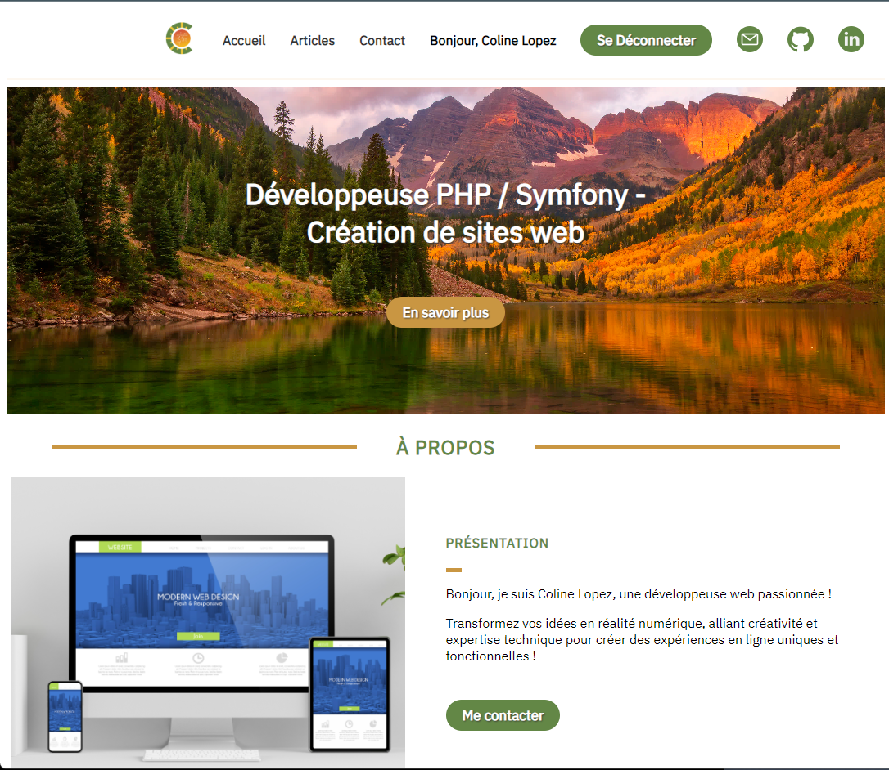

# My Website - OpenClassrooms' Project 5

### Context 

The main objective of this project is to create a professional blog using PHP. The website is divided into two distinct categories of pages: those accessible to all visitors and those restricted to administrators.

### Workspace environment 

This project was developed only on a local server, using WAMP. 
PHP version : 8.0.26
SQL version : 8.0.31

### Clone Project on your machine 

git clone https://github.com/ColineLopez/mywebsite.git

### Project's screenshot

